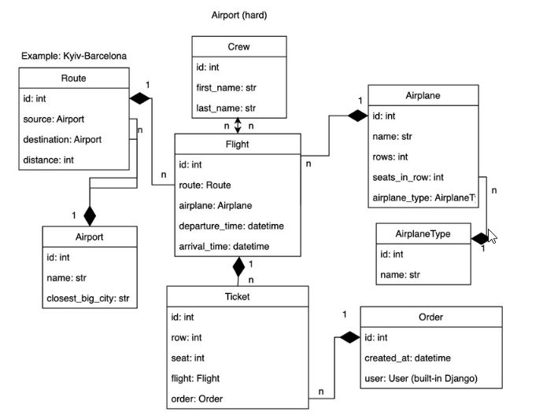

# Airport Service API

API service for managing airport with DRF. 
Implemented possibility of managing airplanes, airports, flights, 
Also you can order tickets for the specified flights.

## Installation

Python 3 should be installed. Docker should be installed.

    github.com/rakamakaphone/airport-service-api
    cd airport-service-api
    python -m venv venv
    source venv\Scripts\activate
    pip install -r requirements.txt
    python manage.py migrate    
    python manage.py runserver

This project uses environment variables to store sensitive information such as the Django secret key.
Create a `.env` file in the root directory of your project and add your environment variables to it.
This file should not be committed to the repository.
You can see the example in `.env.sample` file.

## Getting access
Use the following command to load prepared data from fixture to test and debug your code:

    python manage.py loaddata fixture_data.json

After loading data from fixture you can use user (or create another one by yourself):

    Login: admin@admin.com
    Password: pass1234

    create user via /api/user/register/
    get access token via /api/user/token/

## Features

1. Admin panel.
2. Creating user via email.
3. Managing own profile.
4. For Admin user added possibility to manage airplanes, airports, routes, crew.
5. Filtering flights by source, destination, date.
6. Creating orders and tickets for the specified flight.
7. Added different permissions for different actions.
8. Added tests for different endpoints.
9. JWT authenticated.
10. Documentation located at /api/doc/swagger/

## Schema

